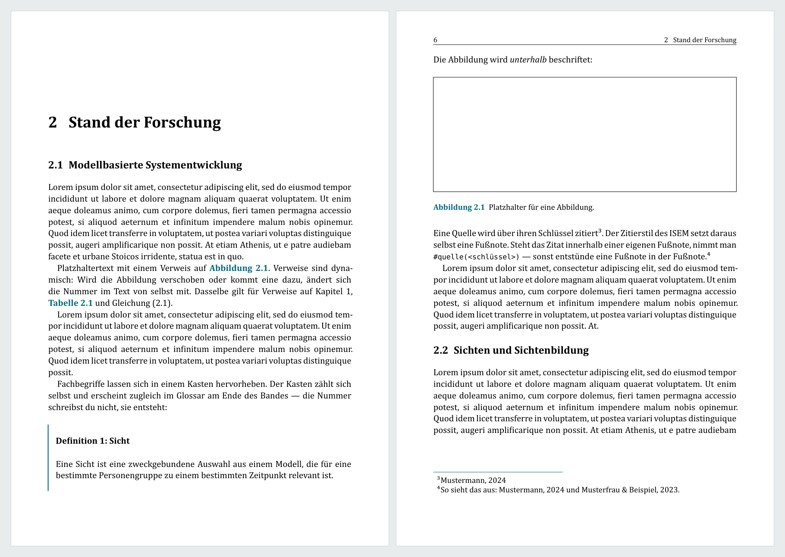
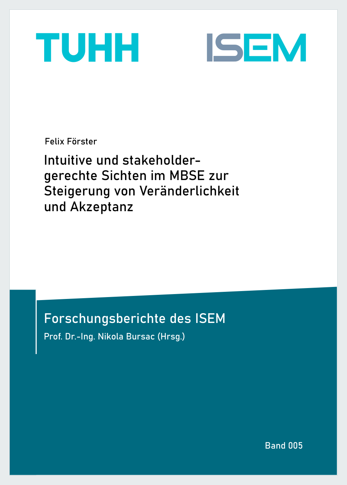

# ISEM-Dissertationsvorlage

Satzvorlage für die Reihe **Forschungsberichte des ISEM** — Institut für Smarte
Entwicklung und Maschinenelemente, Technische Universität Hamburg.

Aus einer Quelle entstehen drei Dateien:

| Was | Datei | wofür |
|---|---|---|
| Druckfassung | `build/Druckversion/innenteil.pdf` + `umschlag.pdf` | an die Druckerei |
| Onlinefassung | `build/Onlineversion/dissertation.pdf` | zum Lesen und Verschicken |
| Archivfassung | `build/Archivversion/innenteil.pdf` | für TORE und die DNB |

| Kapitelanfang und Folgeseite | Umschlag |
|---|---|
|  |  |

Beides stammt aus dem Demoband, den `.auen.ps1` erzeugt. Er liegt auch
fertig bei den [Releases](../../releases) — ein Klick statt einer
Installation.

Gesetzt wird mit [Typst](https://typst.app). Wenn du noch nie damit gearbeitet
hast: Das ist kein Hindernis. Du schreibst in gewöhnlichen Textdateien, und
ein Befehl baut daraus das fertige Buch.

---

## In fünf Minuten zum ersten PDF

```powershell
git clone https://github.com/ISEM-TUHH/dissertationsvorlage.git
cd dissertationsvorlage
.\bauen.ps1
```

Danach liegt alles in `build/`. Wenn etwas fehlt, sagt dir das Skript, was.

Für den Alltag reicht:

```powershell
cd Innenteil
typst watch main.typ ../build/Onlineversion/innenteil.pdf
```

Typst baut dann bei jedem Speichern neu — meist in unter einer Sekunde.

---

## Was du brauchst

| | wofür | woher |
|---|---|---|
| **Typst** ab 0.13 | der Satz selbst | `winget install Typst.Typst` |
| **Python** ab 3.10 | Prüfskripte und Druckdateien | [python.org](https://www.python.org) |
| **Ghostscript** | CMYK-Wandlung des Innenteils | [ghostscript.com](https://www.ghostscript.com) |
| **Cambria** | die Schrift der Reihe | liegt jedem Windows und jedem Office bei |
| PyMuPDF, Pillow | für die Skripte | `pip install -r requirements.txt` |

Das Farbprofil `ISOcoated_v2_300_eci.icc` liegt bei. Es stammt vom
[European Color Initiative](https://www.eci.org) und darf frei verwendet
werden.

---

## Wo du was einträgst

Im Alltag brauchst du zwei Dateien:

- **`Innenteil/angaben.typ`** — Titel, Name, Gutachter, Datum, welche Teile
  mitkommen sollen. Ganz oben steht die wichtigste Zeile:

  ```typst
  fassung: "eingereicht",   // oder "genehmigt"
  ```

  Sie schaltet zwischen der Fassung für den Promotionsausschuss und der
  gedruckten Fassung für die Reihe um — mit allem, was daran hängt:
  Deckblatt, Erklärungen, Lebenslauf.

- **`Cover/buchdaten.typ`** — Angaben für den Umschlag, vor allem die
  Seitenzahl des Buchblocks. Aus ihr rechnet die Vorlage die Rückenstärke.

Deine Kapitel liegen als einzelne Dateien in `Innenteil/kapitel/`.

Alles Weitere steht ausführlich in **[ANLEITUNG.md](ANLEITUNG.md)** — von der
Installation über Zotero bis zur Übergabe an die Druckerei.

---

## Was die Vorlage von selbst tut

- **Registerhaltiger Satz.** Alle Zeilen liegen auf einem Raster von 12,9 pt,
  Vorder- und Rückseite eines Blattes stehen auf gleicher Höhe.
- **Gespiegelte Stege im Druck** (Bund 14 mm, außen 15 mm), symmetrisch am
  Bildschirm.
- **Druckfertige Dateien**: Beschnittzugabe, TrimBox, CMYK, Schwarz nur im
  K-Kanal, eingebettete Ausgabebedingung, Seitenzahl durch vier teilbar.
- **Verzeichnisse** für Abbildungen, Tabellen, Formelzeichen, Abkürzungen und
  Definitionen — alle aus dem Text erzeugt, keines von Hand gepflegt.
- **Mikrotypografie**: schmale geschützte Leerzeichen, echte Kapitälchen,
  Cambria Math für Formeln, Aufzählungszeichen in der Hausfarbe.

Warum das so eingerichtet ist, steht in
**[AENDERUNGEN-GEGENUEBER-WORD.md](AENDERUNGEN-GEGENUEBER-WORD.md)** — dort
ist auch beschrieben, welche dieser Punkte sich in Word nachbauen lassen und
wie.

---

## Prüfskripte

Nach jedem `.\bauen.ps1` laufen die Prüfungen automatisch mit. Einzeln
aufrufen lassen sie sich auch:

```powershell
cd Innenteil
python tools/pruefen.py           # Druckvorgaben: Format, Beschnitt, Farbe, Schriften
python tools/tuhh_pruefen.py      # Formalia der TUHH
python tools/umbruch_pruefen.py   # Hurenkinder, Schusterjungen, Trennungen
```

### Werkzeuge für die Übernahme einer bestehenden Arbeit

Acht der Skripte erwarten als Argument ein Original-PDF. Sie werden nur
gebraucht, wenn eine bereits gesetzte Arbeit in die Reihe übernommen wird —
so ist Band 000 entstanden. Für eine neu geschriebene Dissertation sind sie
ohne Bedeutung:

```powershell
python tools/textabdeckung.py <original.pdf>            # fehlt Text?
python tools/fussnoten_wortlaut.py <original.pdf>       # stimmt jede Fußnote?
python tools/fussnoten_mengen.py <original.pdf>         # fehlt oder doppelt?
python tools/fussnote_original.py <original.pdf> 42     # Wortlaut einer Fußnote
python tools/zitate_richtigstellen.py <original.pdf> 2  # richtige Quelle zitiert?
python tools/abbildungen_pruefen.py <original.pdf>      # Abbildung abgeschnitten?
python tools/aufzaehlungen_abgleichen.py <original.pdf> # Aufzählung abgegrenzt?
python tools/absaetze_zusammenfuehren.py <original.pdf> # Absatz zerrissen?
```

### Umbruch beheben, ohne den Text zu ändern

Zwei Werkzeuge beheben Umbruchprobleme selbst, **ohne den Text zu ändern** —
über eine unsichtbare Klammer um das umbrechende Wort oder über lokal
erhöhte Satzkosten:

```powershell
python tools/umbruch_heilen.py --auch-verso
python tools/absatzumbruch_heilen.py
```

Der Wortlaut der Autorin oder des Autors bleibt dabei unangetastet.

---

## Ordner

```
Innenteil/       Text, Literatur, Titelei
  angaben.typ      alle Angaben zur Arbeit
  main.typ         Reihenfolge der Bestandteile
  kapitel/         deine Kapitel
  titelei/         Vorwort, Danksagung, Kurzfassung, Abstract …
  src/             der Satz selbst - hier musst du nichts ändern
  tools/           Prüfskripte
Cover/           Umschlag
  buchdaten.typ    Titel, Verfasser, Seitenzahl
build/           die fertigen Dateien
```

---

## Ein vollständiges Beispiel

Band 000 der Reihe — die Dissertation von Nikola Bursać — ist mit dieser
Vorlage gesetzt und dient als Belegexemplar: alles, was dort läuft, läuft
auch in einer neuen Arbeit. Der Band liegt in einem eigenen, nicht
öffentlichen Repository; wer hineinsehen möchte, meldet sich beim Institut.

---

## Fassungen

Was sich von Fassung zu Fassung ändert, steht in
**[CHANGELOG.md](CHANGELOG.md)**. Notiere in , mit
welcher Fassung du begonnen hast — dann ist später nachvollziehbar, warum
ein älterer Band anders aussieht als ein neuer.

---

## Lizenz

**[CC0 1.0](LICENSE)** — gemeinfrei, so weit das Recht es zulässt. Nimm sie,
ändere sie, gib sie weiter, auch gewerblich. Du musst uns nicht nennen und
nicht fragen. Wenn du magst, sag uns trotzdem Bescheid — wir freuen uns.

Vier Bestandteile sind davon ausgenommen, weil sie uns nicht gehören oder
eine eigene Lizenz tragen: der Zitierstil (CC BY-SA 3.0, abgeleitet vom
APA-Stil), die Logos von TUHH und ISEM, das Farbprofil der ECI und die
Schrift Cambria. Die Einzelheiten stehen in **[NOTICE](NOTICE)**.

---

## Mitmachen

Fehler und Wünsche gern als Issue. Wenn dir beim Schreiben etwas auffällt,
das die Vorlage übernehmen sollte, ist das die richtige Stelle dafür — jede
Arbeit macht die Vorlage für die nächste besser.
